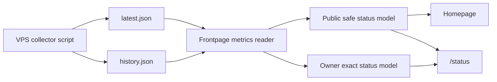

# Frontpage Project OS Dashboard Design

Date: 2026-07-09
Status: draft pending written-spec review
Companion schemas:

- `2026-07-09-frontpage-metrics.schema.v1.json`
- `2026-07-09-frontpage-metrics-history.schema.v1.json`

## Goal

Give `reidar.tech` a proper facelift from a lean portfolio into a live "Project OS Dashboard." The site should still explain Reidar's projects, but the first impression should be an operational workbench: project posture, live service health, VPS status, freshness, and activity signals.

The design keeps a hybrid visibility model:

- Public visitors see coarse VPS and service status, freshness, project posture, and safe health summaries.
- The signed-in owner sees exact CPU, RAM, disk, load, uptime, container, and internal service details.

## Non-Goals

- No full monitoring platform in v1.
- No WebSocket or SSE real-time stream.
- No history beyond a rolling 24-hour metrics file.
- No alerting or notification channel.
- No multi-host support.
- No admin UI for service-check configuration.
- No shell, SSH, Docker socket, or privileged host access from the Next.js app.

## Chosen Approach

Use a Frontpage-bundled v1 host collector plus a server-side metrics reader.

The collector runs on the VPS every 60 seconds, writes bounded JSON files, and is deployed through this repository for v1. The stable boundary is the versioned JSON schema, so the collector can later move into neutral VPS operations without changing the UI or reader contract.

The Next.js application only reads metrics JSON from `METRICS_DIR`. It does not collect host metrics itself and does not require privileged access.



## Files And Runtime Paths

The production metrics directory must be configured explicitly through `METRICS_DIR`. Production must not silently fall back to a writable app-local path.

Planned runtime files:

- `${METRICS_DIR}/latest.json`
- `${METRICS_DIR}/history.json`

The app container mounts the metrics directory read-only. The collector owns writes and uses atomic replacement so the reader never observes a partially written JSON file.

Production permission target:

- Host metrics directory: `/var/lib/frontpage-metrics`.
- Collector identity: a dedicated `frontpage-metrics` system user owns writes.
- App identity: the Frontpage container continues to run as its existing `node` user and receives the metrics directory as a read-only bind mount.
- The app process can read the metrics files but cannot write, truncate, or replace them through the production mount.
- Ansible verifies the mount mode and effective file access during deploy instead of assuming the container can write.

## Metrics Schema

`latest.json` must match `docs/superpowers/specs/2026-07-09-frontpage-metrics.schema.v1.json`.

`history.json` must match `docs/superpowers/specs/2026-07-09-frontpage-metrics-history.schema.v1.json`. It is a bounded wrapper around snapshot samples:

```json
{
  "schema_version": 1,
  "samples": []
}
```

Each sample in `samples` must be a complete v1 metrics snapshot. The writer keeps at most 1,440 samples, matching one sample per minute for 24 hours.

Both files require `schema_version: 1`. Snapshot objects also require:

- `collected_at` as ISO 8601 UTC
- exact host metrics, with `cpu_percent` normalized to a 0-100 host-capacity percentage
- service checks
- container statuses

Public versus owner visibility is not a file-level schema split. Exact values can exist in the metrics files; the server-side reader and renderer decide what is safe to expose.

If either file's `schema_version` is absent or not `1`, the reader treats that file as unavailable.

All snapshot timestamps end in `Z`. The reader still parses timestamps into real dates before freshness comparison, enables JSON Schema date-time format assertions where the validator supports them, and rejects invalid dates even if a regex would match them. Non-UTC-offset timestamp strings are schema-invalid in v1.

If any history sample is missing `schema_version: 1` or fails the embedded snapshot schema, the reader treats `history.json` as unavailable. A bad history file does not make `latest.json` unavailable.

The schema caps `services` and `containers` at 64 entries each and requires unique full objects. The collector and reader also enforce unique `id` values inside each array, because JSON Schema cannot express property-level uniqueness portably.

## Collector Responsibilities

The v1 collector:

- Runs every 60 seconds through a systemd timer.
- Reads a static service-check config committed to the repo.
- Collects CPU percent, RAM bytes, disk bytes, load average, and uptime.
- Runs bounded HTTP/HTTPS GET checks for public and internal services.
- Supports expected HTTP status configuration.
- Checks allowlisted container names from static config when Docker is available on the host.
- Caps per-check timeout at 10 seconds.
- Writes `latest.json` and `history.json` atomically.
- Keeps 24 hours of history at most.
- Sanitizes output by design.

The v1 collector does not:

- Execute arbitrary probe commands.
- Run `docker exec`.
- Read container env, logs, labels, mounts, networks, or image metadata.
- Expose raw HTTP response bodies or headers.
- Write stack traces, host paths, env vars, tokens, or secrets.
- Provide dynamic probe configuration through the admin UI.

## Static Check Config

The collector reads one static JSON config file deployed with the app. It is reviewed in git and does not contain secrets.

Shape:

```json
{
  "schema_version": 1,
  "services": [
    {
      "id": "frontpage-public",
      "label": "Frontpage",
      "project_slug": "frontpage",
      "visibility": "public",
      "url": "https://reidar.tech/api/health",
      "expected_status": 200,
      "timeout_ms": 5000
    }
  ],
  "containers": [
    {
      "id": "frontpage-container",
      "label": "Frontpage container",
      "project_slug": "frontpage",
      "name": "frontpage"
    }
  ]
}
```

Config constraints:

- `timeout_ms` is capped at 10,000 even if the config requests more.
- `url` must be `http` or `https`.
- No custom headers in v1.
- No secrets in URLs.
- Container names are allowlisted exact strings, not patterns.

## Service And Container Checks

Service checks are static and intentionally narrow.

Supported v1 check type:

- HTTP/HTTPS GET with an expected status code and timeout.

Service results are limited to:

- `up`
- `down`
- `unknown`
- `latency_ms`
- `checked_at`

Timed-out checks record `latency_ms: null`. Completed checks round latency to an integer number of milliseconds and clamp reported latency to the schema maximum of 10,000 ms.

`project_slug` is optional. Services with a slug join into the homepage project operations table. Services without a slug appear only in the `/status` service inventory and aggregate counts.

Internal service checks are allowed, but they still use the same HTTP/HTTPS mechanism. Any future command checks, socket-level probes, raw Docker inventory, or dynamic probe definitions require a separate design.

Container statuses are collected only for allowlisted names in static config. The collector records running/healthy as `up`, stopped/unhealthy as `down`, and unavailable Docker status as `unknown`. Container statuses are owner-only in v1 and intentionally have no public `visibility` field. If a container needs public health, configure a public HTTP service check for the application it serves. Public visitors should see public service health, not raw container inventory.

## Staleness State Machine

The reader converts metrics into one of three states:

- `fresh`: `collected_at` is 90 seconds old or newer.
- `stale`: older than 90 seconds and not older than 5 minutes.
- `unavailable`: missing file, malformed JSON, schema mismatch, missing required fields, invalid timestamp, or older than 5 minutes.

UI behavior:

- `fresh`: render health and metrics normally.
- `stale`: render last known status with a stale warning and timestamp.
- `unavailable`: render project data and an unknown status panel. The homepage must not crash because metrics are unavailable.

`history.json` may be missing or empty immediately after deployment. Sparklines render an empty state in that case.

## Public Derivation

Public views must receive a derived model, not filtered exact host metrics.

Public host status includes:

- overall VPS state: `online`, `pressure`, `stale`, or `unknown`
- disk pressure bucket: `ok`, `watch`, or `critical`
- service summary counts
- freshness label
- last updated age

Disk pressure buckets:

- `ok`: less than 75% used
- `watch`: at least 75% and less than 90% used
- `critical`: 90% used or higher

Public views do not include:

- exact CPU percent
- exact RAM bytes or percent
- exact disk bytes or percent
- load averages
- uptime seconds
- raw container list
- internal-only service labels

## Owner-Only Metrics

Owner-only metrics are available only after server-side session and owner verification.

Enforcement rules:

- If rendered in Server Components, `auth()` and owner checks happen before exact data becomes props.
- If exposed through an API route, that route independently verifies the session and owner on every request.
- No `?admin=true`, client-side filtering, or hidden public payload may reveal exact metrics.

Owner-only views may show:

- CPU percent
- RAM used/total and percent
- disk used/total and percent
- load averages
- uptime
- container statuses
- internal service checks
- exact timestamps and staleness diagnostics

## Homepage UI

The homepage becomes a Project OS workbench.

Primary sections:

1. Top workbench band with overall public status, active project count, service summary, and freshness.
2. Project operations table combining curated project posture and live health where configured.
3. VPS public status panel with coarse health, disk pressure, service count, and last update.
4. Recent activity/signals using existing GitHub stats and current service-check summaries.

The visual style keeps the existing zinc/green terminal foundation, but adds restrained cyan, amber, and red operational accents. The page should feel dense, quiet, and useful rather than decorative.

## `/status` UI

The `/status` page provides the detailed status surface.

Public view:

- all public services
- public health state
- freshness warnings
- outage and stale states
- 24-hour coarse sparklines

Owner view:

- exact host metrics
- exact 24-hour sparklines
- container health
- internal service checks
- reader diagnostics for stale or invalid data

## Component Boundaries

Planned components and modules:

- `ProjectDashboard`: homepage orchestration.
- `ProjectHealthRow`: curated project data plus optional live service health.
- `VpsStatusSummary`: public-safe VPS widget.
- `MetricsSparkline`: tiny 24-hour visual tolerant of empty history.
- `StatusPage`: route-level status view.
- `OwnerMetricsPanel`: server-auth-gated exact metrics.
- `metrics-reader`: server-side schema validation, staleness state, and public/private derivation.

## Deployment

Ansible updates the VPS with:

- collector script
- static service config
- `frontpage-metrics-collector.service`
- `frontpage-metrics-collector.timer`
- metrics directory with collector write access
- read-only metrics mount into the Frontpage container
- `METRICS_DIR` environment variable for the app

Deploy should fail before claiming success if collector installation or timer enablement fails.

Existing `/api/health` remains app-health only. Host health belongs in the status dashboard and any future status endpoint, not in the container health check.

## Testing And Verification

Design-level verification for implementation:

- Schema validation accepts valid v1 snapshots.
- Schema validation rejects absent or mismatched schema versions.
- Missing, malformed, stale, and unavailable metrics produce safe degraded reader results.
- Public derivation never includes exact host metrics.
- Owner derivation requires server-side owner verification.
- Service status bucketing handles `up`, `down`, and `unknown`.
- History handling tolerates missing, empty, and partially old histories.
- Homepage and `/status` render when metrics are unavailable.

Command verification:

- `npm run lint`
- `DATA_DIR="$(mktemp -d)" npm run build`

Deploy proof later must include:

- collector timer is active
- metrics files are fresh
- Frontpage container has read-only metrics access
- public homepage and `/status` render
- owner-only view does not leak through public responses

## Open Decisions Resolved

- Visibility: hybrid public summary plus owner-only exact details.
- Collection cadence: every 60 seconds.
- Visual direction: Project OS Dashboard.
- Project rows: both curated posture and live health where configured.
- Surfaces: homepage summary plus `/status` detail.
- Service checks: public and internal HTTP/HTTPS checks.
- Collector ownership: bundled in Frontpage v1, schema-bound for future extraction.
- History: latest snapshot plus rolling 24-hour mini-history.
