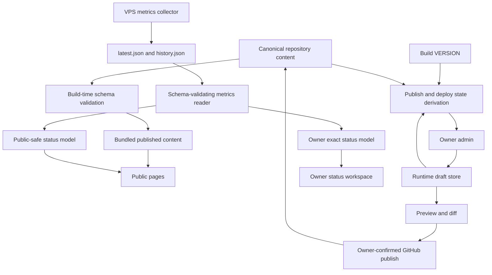

# Frontpage Trust-First Project OS Redesign

Date: 2026-07-09
Status: written specification pending user review
Approved direction: Trust-first Project OS

Related contracts:

- `docs/superpowers/specs/2026-07-09-frontpage-project-os-dashboard-design.md`
- `docs/superpowers/specs/2026-07-09-frontpage-metrics.schema.v1.json`
- `docs/superpowers/specs/2026-07-09-frontpage-metrics-history.schema.v1.json`

## 1. Purpose

Frontpage should be a trustworthy public index of Reidar's work and a useful
private operator surface for the systems behind that work.

The redesign keeps the accepted Project OS direction, but changes its hierarchy:

1. Identity and value are immediately understandable.
2. Flagship projects are supported by real evidence and media.
3. Project posture is explicit and conservative.
4. Infrastructure health supports the portfolio story instead of replacing it.
5. Owner-only pages explain what needs attention and what action is safe.

The site should feel like a quiet, credible workbench. It should not feel like a
generic developer portfolio, a decorative terminal, or a monitoring product with
too little monitoring data.

## 2. Relationship To The Existing Metrics Design

The existing metrics design remains authoritative for:

- host collector ownership
- `latest.json` and `history.json`
- the 60-second collection cadence
- public versus owner visibility
- schema validation
- freshness thresholds
- read-only metrics mounts
- probe and container security boundaries

This specification supersedes the homepage and `/status` presentation sections
of the earlier design. It also adds a content-authority model, a project-posture
model, a redesigned public information architecture, and owner-workspace rules.

The metrics schemas do not need to change merely to implement this redesign.
Project-level health and coarse public history can be derived from the current
v1 metrics data.

## 3. Audiences And Jobs

### 3.1 Public visitor

A public visitor should be able to answer these questions within ten seconds:

- Who is Reidar?
- What kind of software does he build?
- Which projects matter most?
- Which projects are active, experimental, maintained, or archived?
- Which claims have current evidence?
- Which public services are healthy right now?
- Where can I inspect the work or try it?

The visitor should not need to understand VPS administration, Auth.js, container
health, or internal deployment terminology.

### 3.2 Reidar as owner

The owner should be able to answer:

- Does anything need attention?
- Is the underlying data fresh and valid?
- Which project content is draft, published, or deployed?
- Which services or containers are unhealthy?
- What changed recently?
- Which safe next action should I take?
- What must not be claimed yet?

The owner workspace may expose exact host and container details after server-side
owner verification. It must not provide shell access, Docker control, or remote
command execution.

## 4. Design Principles

### 4.1 Truth before decoration

The interface must never imply that stale, incomplete, or unmonitored data is
current evidence. Missing data should reduce the claim, not produce a reassuring
default.

### 4.2 Separate posture dimensions

Lifecycle, maturity, runtime health, and evidence freshness are different facts.
They must have separate labels, derivation rules, and visual treatment.

### 4.3 Evidence near the claim

A project marked active or live should show the evidence supporting that claim
near the label: a recent review, CI result, live check, or deployed proof.

### 4.4 Public value before infrastructure

The first viewport should identify Reidar and the strongest work. VPS status is
supporting proof, not the main product offer.

### 4.5 Owner actions remain deliberate

Drafting, publishing, and deploying are separate state transitions. The UI must
name them precisely and require confirmation before an external publish action.

### 4.6 Dense but legible

Operational density is welcome when labels, grouping, contrast, and responsive
behavior make the information scannable. Small gray text is not density.

### 4.7 Real media over decorative media

Project screenshots, diagrams, and verified outputs should carry the visual
identity. Do not add decorative gradients, abstract blobs, or fake product
mockups.

## 5. Non-Goals

- No monitoring platform replacement.
- No WebSocket or SSE live stream.
- No multi-host observability.
- No alerting or notification system in this redesign.
- No public exact CPU, RAM, disk, load, uptime, container, or internal service data.
- No shell, SSH, Docker socket, command runner, restart button, or privileged host action.
- No automatic production deployment from the admin UI.
- No external CMS or database requirement.
- No visitor accounts, comments, likes, or social features.
- No decorative animation system.
- No fabricated screenshots or generated product evidence.

## 6. Confirmed Current-State Problems

The design responds to these verified conditions:

- Production serves 11 older project records while current source contains 13.
- Nytt and RFS are present in source but missing from the live catalogue.
- Live THORArb posture contradicts the conservative source posture.
- One shared `.data_version` can refresh one runtime data file while making the
  other stale file look current.
- The homepage exposes mostly `not probed` and `no repo signal` values because
  only Frontpage has a public service probe and repository stats are unavailable.
- Project operation rows have no column headers and lose meaning on mobile.
- The desktop project-detail metadata column can consume most of the layout.
- Public `/status` does not render its already-derived coarse 24-hour history.
- Owner status omits uptime, diagnostics, exact collection time, and thresholds.
- Admin save state does not clearly distinguish local persistence from GitHub
  publication or production deployment.
- Authenticated navigation does not have a mobile-safe owner information
  architecture.
- Normal labels use contrast ratios below WCAG AA.
- Project media, social-preview media, custom sign-in, and custom not-found
  surfaces are absent.

## 7. Canonical Content And Publication Model

### 7.1 Single source of published truth

Published public content must come from validated, version-controlled JSON files
bundled into the deployed image.

Recommended canonical paths:

```text
content/personal.json
content/projects.json
src/lib/content/schema.ts
```

`src/lib/content/schema.ts` is the canonical Zod schema used at build time,
runtime read time, draft save time, and publish time. A generated JSON Schema may
be added for documentation, but it is not a second source of validation truth.

`src/data/personal.ts` and `src/data/projects.ts` should be migrated into the
canonical structured content files or reduced to typed import wrappers. The site
must not maintain two independently editable published datasets.

Public routes always read the bundled, validated published content. They do not
read a mutable runtime override.

### 7.2 Runtime data is draft data

The persistent `/data` volume may store owner drafts and publication receipts:

```text
/data/drafts/personal.json
/data/drafts/projects.json
/data/receipts/latest-publish.json
```

Drafts never alter public pages merely because they were saved. The admin UI must
preview draft content explicitly.

### 7.3 Publication states

The owner UI must display these states distinctly:

- `Clean`: draft matches the currently deployed content.
- `Draft saved`: changes exist only in the runtime draft store.
- `Published`: canonical repository content on `main` was updated at a known commit.
- `Awaiting deploy`: the published commit is newer than the deployed version.
- `Deployed`: the running image version includes the published content commit.
- `Conflict`: the canonical source changed after the draft base version.
- `Publish failed`: the external GitHub mutation did not complete.

`Saved` alone is not sufficient copy.

### 7.4 Publish operation

Publishing is an owner-confirmed external side effect.

The v1 canonical publication branch is `main`. Publish writes directly to
`content/personal.json` and/or `content/projects.json` on `main` with optimistic
concurrency. If repository branch protection does not permit that operation, the
publish fails closed and preserves the draft; the UI does not silently switch to
another branch or claim publication.

The publish flow:

1. Validate the complete draft.
2. Compare the draft base commit with the current canonical file SHA.
3. Show a human-readable diff.
4. Require explicit confirmation.
5. Update the canonical content file through GitHub with optimistic concurrency.
6. Record the resulting commit SHA and URL in a receipt.
7. Show `Awaiting deploy` until the running `VERSION` proves deployment.

A failed GitHub operation leaves the draft intact and does not claim publication.

The redesign does not automatically merge branches, run Ansible, or deploy from
the browser.

### 7.5 Deployment version

The running application must expose its build version to owner-only status and
admin derivation. The value should be a full or unambiguous Git commit identity,
not a floating `latest` label.

Public pages may show a short content review date. They do not need to expose the
full deployment SHA unless deliberately included in a technical footer.

### 7.6 Production migration

Migration from the existing runtime override is deliberate and one-time:

1. Export the current production personal and project JSON.
2. Compare production, ignored local runtime files, and current source.
3. Reconcile each project manually, preserving conservative source posture.
4. Validate the canonical JSON.
5. Back up the old runtime files outside the application read path.
6. Deploy the canonical-content reader.
7. Verify project counts, slugs, flagship routes, and posture labels live.

Do not automatically overwrite or merge the old production files.

## 8. Project Posture Model

### 8.1 Stored project fields

Each public project should support:

```ts
interface ProjectContent {
  slug: string;
  name: string;
  outcome: string;
  shortDescription: string;
  longDescription: string;
  lifecycle: "active" | "maintained" | "paused" | "archived";
  maturity: "flagship" | "stable" | "experimental" | "reference";
  category: string;
  tags: string[];
  techStack: string[];
  featuredRank?: number;
  repoUrl?: string;
  liveUrl?: string;
  media?: ProjectMedia;
  healthServiceIds?: string[];
  evidence: ProjectEvidence;
  limitations?: string[];
}
```

`outcome` is a plain-language statement of what the project helps someone do. It
is not a technology summary.

### 8.2 Lifecycle

- `active`: current development or operational work is ongoing.
- `maintained`: functionally complete enough for its intended scope and still
  supported when needed.
- `paused`: intentionally inactive but may resume.
- `archived`: historical or replaced; no current support claim.

`Completed` is removed because it does not explain whether a project is
maintained, archived, or safe to use.

### 8.3 Maturity

- `flagship`: one of Reidar's strongest current products or technical bodies of work.
- `stable`: useful within its stated scope, with known boundaries.
- `experimental`: incomplete safety, validation, or durability gates remain.
- `reference`: retained for learning, history, or supporting tooling.

Maturity never derives from repository activity alone.

### 8.4 Runtime health

Runtime health is derived, never manually stored:

- `operational`: all configured public checks are up and fresh.
- `degraded`: a subset of checks is down or unknown while some remain up.
- `down`: all configured public checks are down.
- `unknown`: configured checks are stale or unavailable.
- `not monitored`: no public health binding exists.

The UI must say `Not monitored`, not `Not probed`. It must not style that state as
a failure.

### 8.5 Evidence

Project evidence should support:

```ts
interface ProjectEvidence {
  reviewedAt: string;
  level: "source-reviewed" | "ci-verified" | "live-verified";
  commitSha?: string;
  url?: string;
  note: string;
}
```

Evidence freshness is derived from `reviewedAt`:

- `current`: reviewed within 30 days.
- `aging`: reviewed 31-90 days ago.
- `stale`: reviewed more than 90 days ago.
- `unknown`: no valid review timestamp.

These thresholds describe content evidence, not metrics freshness. The labels
must not share the same component without clear context.

### 8.6 Repository activity

Last commit age, language, and stars are optional repository metadata. They are
not project status or verification evidence.

When GitHub stats are unavailable, hide the repository activity field. Do not
fill the primary interface with `no repo signal`.

## 9. Overall Public Status Derivation

The homepage and public status page need an explicit overall state separate from
host reachability.

Derivation order:

1. Metrics unavailable: `Status unavailable`.
2. Metrics stale: `Status delayed`.
3. Any public service down: `Service disruption`.
4. Any public service unknown or disk critical: `Degraded`.
5. All configured public services up: `Operational`.
6. No public services configured: `No public checks`.

The current host state may remain a separate field called `VPS collector state`
or `Host telemetry`. It must not be presented as overall site status.

## 10. Global Information Architecture

### 10.1 Public routes

```text
/
/projects
/projects/[slug]
/status
/api/auth/signin
```

### 10.2 Owner routes

```text
/admin
/admin/projects/[slug]
/ansible
/proposals (existing external or reverse-proxied surface)
```

The implementation may use route groups to separate public and owner shells, but
the URLs remain stable unless a later plan explicitly migrates them.

### 10.3 Header

Desktop public header:

- Reidar wordmark/home link.
- Projects.
- Status with a compact semantic status dot and text available to assistive technology.
- GitHub icon link.
- Owner access icon/menu.

The current duplicate `Home` link is removed because the wordmark is the home
control.

Authenticated owner links move into one owner menu instead of expanding the
public horizontal navigation. The menu contains Admin, Ansible, Proposals, View
site, and Sign out.

Mobile header:

- Wordmark.
- Compact overall-status indicator.
- Menu icon button with an accessible name.
- Public and owner links inside the menu.

No header label may wrap at 360px.

Active routes use `aria-current="page"` and a visible non-color-only state.

### 10.4 Footer

The footer remains restrained and includes:

- Reidar and current year.
- GitHub and configured public social links.
- A compact status link.
- Optional short deployed-version identifier only when intentionally enabled.

Do not publish a new email address unless it is explicitly configured for public use.

## 11. Homepage Specification

### 11.1 First viewport

The first viewport is an unframed identity and orientation band.

Required content:

- Eyebrow: `REIDAR.TECH / PROJECT OS`.
- H1: `Reidar`.
- Supporting offer: `I build and operate web products, technical tools, and
  infrastructure with clear evidence and honest limits.`
- Reidar's existing line about systems that work without babysitting may remain
  as supporting voice.
- Primary action: `View flagship projects`.
- Secondary action: `View system status`.

The H1 must be the person/brand, not the abstract phrase `Live workbench for
projects, infra, and trust signals`.

The first viewport must leave a visible hint of the flagship-project section on
common mobile and desktop viewports.

### 11.2 Current-status band

Immediately below the identity copy, render one full-width compact status band:

- Overall public status.
- Public services up/total.
- Metrics age.
- Disk pressure bucket.
- Link to `/status`.

This band is not four disconnected statistic cards. It is one coherent current
state with labels and one primary interpretation.

If data is stale or unavailable, the band changes copy and color explicitly. It
must not preserve a green overall state.

### 11.3 Flagship projects

Render three to four projects with the lowest `featuredRank` and `maturity:
flagship`.

Each flagship card contains:

- Real 16:9 project screenshot or verified product media.
- Project name and outcome.
- Lifecycle and maturity.
- Runtime health only when configured.
- Evidence level and review age.
- One primary detail action.
- Optional live/repository actions.

Cards use stable image ratios and content regions so missing badges do not shift
the grid.

If a project has no approved media, omit the image region for that card through
an explicit media-less layout. Do not use a fake screenshot.

### 11.4 Current work table

Below flagships, render a denser current-work table for active and maintained
projects.

Desktop columns:

```text
Project | Lifecycle | Maturity | Health | Evidence | Repository activity
```

Every column has a visible header. Repository activity disappears when the
GitHub source is unavailable rather than displaying repetitive failure copy.

Mobile rows become labelled key-value summaries:

```text
Heimdall
Lifecycle  Active
Maturity   Flagship
Health     Not monitored
Evidence   Live verified, 6d ago
```

The full row remains one project-detail link, while nested external actions are
kept outside that link to avoid invalid interaction nesting.

### 11.5 Recent evidence

`Recent Signals` is replaced by `Recent evidence`.

Show up to three current, source-backed events such as:

- a project evidence review
- a successful live verification
- a CI verification attached to a specific commit

Each item names its source and age. Service checks remain in the status band and
status page, not in a misleading activity feed.

If no reliable evidence events are available, omit the section.

### 11.6 About band

Finish the homepage with a concise unframed band:

- what Reidar builds
- main technical domains
- GitHub/social actions

Do not restore a long generic skills-cloud section. The project evidence should
demonstrate the stack.

## 12. Projects Catalogue Specification

### 12.1 Page header

The page states:

- `Projects` as H1.
- A one-line description of the catalogue's posture model.
- Result count after filters.

### 12.2 Filters

Required controls:

- Search by name, outcome, description, tag, and technology.
- Lifecycle filter.
- Maturity filter.
- Category filter.
- Sort menu: Featured, Recently reviewed, Recently updated, Name.
- Clear filters command.

Category and tag options are derived from canonical content. There is no static
hand-maintained tag list.

Filter state is encoded in URL search parameters so the view is linkable and
restorable.

Controls are grouped with visible labels and accessible names. Primary filter
targets are at least 44px high on touch viewports.

### 12.3 Catalogue cards

Desktop uses a two-column card grid. Mobile uses one column.

Card anatomy:

1. Optional real project media.
2. Name and outcome.
3. Lifecycle and maturity.
4. Short description, capped consistently.
5. Health when monitored.
6. Evidence state.
7. Up to three primary technologies.
8. Detail action.

The card may be the detail link, but external live/repository controls must be
separate sibling controls with clear icons and tooltips.

### 12.4 Empty and degraded states

- No filter matches: explain which filters are active and provide Clear filters.
- GitHub unavailable: render projects without repository metadata.
- Metrics unavailable: render projects with Health unknown only when monitored;
  unmonitored projects remain Not monitored.
- Invalid canonical content: fail the build rather than ship a partial catalogue.

## 13. Project Detail Specification

### 13.1 Header

The project header includes:

- Back to projects.
- Project name as H1.
- Outcome statement.
- Lifecycle, maturity, and evidence badges.
- Primary Live action when a verified live URL exists.
- Secondary Repository action when a repository exists.

Do not put the status badge at the far edge of a wide title row on mobile.

### 13.2 Project media

Use one full-width 16:9 hero screenshot or product-state image below the header.
The asset must show the actual project, not an atmospheric illustration.

Additional media may appear in the body only when it explains a distinct product
state, workflow, architecture, or result.

### 13.3 Evidence strip

Render one compact evidence strip containing:

- Evidence level.
- Reviewed age and exact date.
- Commit identifier when safe and available.
- Runtime health when configured.
- Repository activity when available.

Evidence and activity remain visually distinct.

### 13.4 Body layout

Desktop layout uses a readable main column and a bounded side rail:

```text
minmax(0, 1fr) 280px
```

The main prose column targets 620-720px. The side rail never determines the width
of the main column.

Mobile renders one column in this order:

1. Header and actions.
2. Media.
3. Evidence strip.
4. Main content.
5. Metadata and related projects.

### 13.5 Content sections

Required sections:

- What it solves.
- Current state.
- How it works.
- Evidence.
- Known limitations.
- Next priorities when applicable.
- Related projects.

The current long description may seed these fields, but implementation should
not parse arbitrary prose into sections. Canonical content must store structured
section data or explicit arrays.

### 13.6 Missing project

Provide a branded not-found page with:

- `Project not found`.
- Link back to the catalogue.
- Link home.
- No raw framework styling.

## 14. Public Status Specification

### 14.1 Header

The page starts with:

- `System status` as H1.
- Current overall public state.
- Last data update in relative time with exact UTC time available on hover/focus.
- Plain-language privacy copy: `Public status shows service health without
  exposing private host details.`

Do not lead with server-side rendering implementation language.

### 14.2 Summary band

Render one status summary with:

- Overall state.
- Public services up/total.
- Host telemetry freshness.
- Disk pressure bucket.

The summary must obey the overall derivation in Section 9.

### 14.3 Coarse 24-hour history

Render the existing public history as three semantic strips:

- CPU pressure: Low, Medium, High, Unknown.
- RAM pressure: Low, Medium, High, Unknown.
- Disk pressure: OK, Watch, Critical, Unknown.

The public strips never expose exact values. Each strip includes a textual
summary for assistive technology and a visible legend.

### 14.4 Service inventory

Each public service row contains:

- Service label.
- Current status.
- Relative check age.
- Exact check time through a semantic `time` element.
- Latency when available and still considered public-safe.
- Related project link when `project_slug` exists.

Services may be grouped by project when multiple checks are added later.

### 14.5 Degraded states

- Stale metrics: amber status-delayed callout and last known state.
- Unavailable metrics: neutral unavailable callout; do not claim operational.
- Down service: red disruption callout naming only public-safe services.
- Empty public checks: `No public checks configured`; do not show `0/0 up`.

No historical incident log is claimed in this redesign because the collector
does not currently store incidents as a separate contract.

## 15. Owner Status Specification

Owner content remains server-gated and renders below the public status sections.

### 15.1 Attention summary

Lead with owner interpretation:

- `No attention needed` only when freshness, resource thresholds, services, and
  containers are healthy.
- Otherwise list each issue with severity, reason, and safe next destination.

The panel does not execute corrective actions.

### 15.2 Host resources

Display:

- CPU percentage and threshold context.
- RAM percentage plus used/total bytes.
- Disk percentage plus used/total bytes.
- Load averages.
- Uptime in human-readable form.
- Exact collection timestamp.

Each resource shows current value, 24-hour trend, and threshold bands. Charts
include textual summaries and do not rely on color alone.

### 15.3 Services and containers

Separate sections for:

- Public services.
- Internal services.
- Allowlisted containers.

Each row includes status and exact check time where applicable. Container labels
remain allowlisted display labels, not raw Docker inventory.

### 15.4 Diagnostics

Reader diagnostics appear only to the owner in a collapsible technical section.
Diagnostics are sanitized and must not include secret values, environment dumps,
or unapproved host paths.

### 15.5 Owner destinations

Provide read-only navigation to:

- Admin content workspace.
- Ansible runbook.
- Proposals surface when available.

No restart, prune, deploy, or shell control is added.

## 16. Admin Workspace Specification

### 16.1 Owner shell

Authenticated owner navigation is one menu in the public header and a dedicated
owner workspace navigation inside admin.

Desktop owner navigation:

- Overview.
- Personal content.
- Projects.
- Operations.

Mobile uses a compact tab/menu pattern. It does not render fixed two- or
three-column form grids.

### 16.2 Overview

The overview shows:

- Deployed version.
- Canonical published commit.
- Draft count.
- Draft base version.
- Content validation state.
- Latest publish receipt.
- Whether deployment is current or awaiting deploy.

### 16.3 Project list

Render compact editable project rows with:

- Search.
- Lifecycle and maturity filters.
- Draft indicator.
- Validation state.
- Open editor action.

Do not render every project's full form on one page.

### 16.4 Project editor

The editor supports all canonical fields:

- Name, slug, outcome, descriptions, and structured sections.
- Lifecycle and maturity.
- Category, tags, and technology.
- Featured rank.
- Repository and live URLs.
- Media and alt text.
- Health bindings.
- Evidence and limitations.

Slug validation requires lowercase URL-safe values and uniqueness. URL fields
allow only HTTP/HTTPS. Health bindings must reference configured safe service IDs.

### 16.5 Editing workflow

Commands:

- Save draft.
- Preview draft.
- Discard draft.
- Review diff.
- Publish.

Save draft is local and reversible. Publish is external and requires confirmation.

The editor warns before navigation with unsaved changes. Save and publish states
use `aria-live` announcements and remain visible in the page, not only in a
short-lived corner toast.

### 16.6 Conflict handling

If canonical content changed after the draft base version:

- Block publish.
- Preserve the draft.
- Show canonical-versus-draft differences.
- Require the owner to rebase or discard deliberately.

No last-write-wins behavior.

## 17. Ansible Runbook Specification

`/ansible` remains owner-only and read-only.

### 17.1 Page structure

- Current deployment posture.
- Last known app/collector health.
- Standard deploy command.
- Verification commands.
- Rollback explanation.
- Architecture reference.
- Secret-handling reference.

Long reference sections are collapsible. Current posture and commands remain
visible without scrolling through the full architecture essay.

### 17.2 Command controls

Use copy icon buttons with accessible names and success feedback. Do not make code
blocks editable and do not execute commands.

Commands should prefer inventory aliases and repository-relative paths. Avoid
displaying raw public IP addresses and local SSH key paths when the inventory
already contains that information.

### 17.3 Claims

The runbook must not call the current deployment zero-downtime while also
documenting a container stop/start gap. Use `health-checked deployment with
automatic rollback` and describe the brief maintenance window honestly.

## 18. Sign-In, Loading, Error, And Not-Found States

### 18.1 Sign-in

Provide a branded owner sign-in page:

- Reidar wordmark.
- `Owner access` heading.
- Short explanation that GitHub sign-in is for private administration.
- GitHub sign-in button.
- Return home link.
- Friendly OAuth error state.

Public visitors should not encounter an unexplained framework auth screen.

### 18.2 Loading

Use stable skeletons or compact progress states that preserve page layout. Avoid
full-screen spinners for narrow route transitions when the shared shell is already
available.

Loading text remains available to assistive technology.

### 18.3 Errors

Public error pages never render raw `error.message`. They show:

- What failed in plain language.
- Retry when safe.
- A route back to a stable page.
- Optional digest identifier.

Detailed errors remain in server logs or owner-only diagnostics.

### 18.4 Not found

Provide a branded global not-found page and the project-specific variant from
Section 13.6.

## 19. Visual System

### 19.1 Color roles

Use semantic roles instead of ad hoc green accents:

- Background: zinc-950.
- Raised surface: zinc-900.
- Borders: zinc-800 with stronger interactive borders.
- Primary text: zinc-100.
- Secondary text: zinc-300 or zinc-400.
- Muted text: a contrast-verified custom value no weaker than normal-text AA.
- Information/activity: cyan.
- Healthy/success: green.
- Warning/degraded: amber.
- Failure/disruption: red.
- Reference/maintained: blue where needed.

Green is not the default color for every section heading.

### 19.2 Typography

- Sans serif for outcomes, explanations, and body copy.
- Monospace for timestamps, compact status data, commands, and technical labels.
- Normal operational text is at least 12px and generally 13-14px.
- Body copy is at least 15-16px with comfortable line height.
- Hero H1 uses fixed responsive breakpoints, not viewport-width scaling.
- Letter spacing is zero except restrained uppercase technical eyebrows.

### 19.3 Surfaces

- Cards use an 8px maximum radius.
- No cards nested inside cards.
- Page sections remain unframed or full-width bands.
- Cards are reserved for repeated projects, bounded status tools, and owner edit surfaces.
- Hover and focus states do not resize elements.

### 19.4 Icons

Use a consistent icon library such as Lucide for menu, external link, GitHub,
copy, status detail, and owner access controls.

Icon-only controls have tooltips and accessible names.

### 19.5 Motion

- Restrained hover/focus transitions only.
- No typing animation in the primary identity surface.
- Respect `prefers-reduced-motion`.
- Status changes may fade but must not pulse indefinitely.

## 20. Project Media Contract

Recommended paths:

```text
public/projects/<slug>/cover.webp
public/projects/<slug>/detail-01.webp
public/projects/<slug>/detail-02.webp
```

Media metadata includes:

```ts
interface ProjectMedia {
  cover: {
    src: string;
    alt: string;
    width: number;
    height: number;
  };
  gallery?: Array<{
    src: string;
    alt: string;
    caption?: string;
    width: number;
    height: number;
  }>;
}
```

Requirements:

- Cover media targets 16:9.
- Assets show the actual product, tool, diagram, or verified output.
- Alt text describes the visible product state and its purpose.
- File dimensions and size are validated during CI.
- Sensitive owner-only details are removed before publication.
- No generated image is presented as a real product screenshot.

## 21. Responsive Behavior

Required review widths:

- 360px.
- 390px.
- 768px.
- 1024px.
- 1440px.

Rules:

- No horizontal page overflow.
- Header controls never wrap incoherently.
- Public tables become labelled mobile summaries, not unlabeled vertical columns.
- Fixed-format media uses explicit aspect ratios.
- Status controls and counters have stable dimensions.
- Project cards do not change height because optional metadata appears late.
- Admin forms use one column on mobile, two columns only where labels and values fit.
- Code blocks scroll internally without widening the page.
- Footer actions wrap as a coherent group.

## 22. Accessibility Requirements

Target WCAG 2.2 AA for public and owner surfaces.

Required behavior:

- Skip-to-content link.
- Semantic header, nav, main, section, aside, and footer landmarks.
- Logical heading order without skipping from H1 to H3.
- Visible focus on every interactive element.
- `aria-current` for active navigation.
- `aria-pressed` or equivalent state for filters.
- Visible labels for filter groups.
- Status never conveyed by color alone.
- Minimum 44px primary touch targets.
- Contrast of at least 4.5:1 for normal text and 3:1 for large text/UI components.
- Semantic `time` elements with human-readable text.
- Charts include textual summaries and legends.
- Save, publish, copy, and error feedback use appropriate live regions.
- Reduced-motion support.
- Keyboard-complete owner menus, filters, drawers, and dialogs.

## 23. Metadata And Sharing

Root metadata:

- Title: `Reidar - Project OS`.
- Description: a concise statement about building and operating software with
  evidence and honest limits.
- Canonical URL.
- Open Graph and Twitter card metadata.
- Real social-preview image derived from approved project media or a restrained
  branded bitmap composition.

Project metadata:

- `<project name> - Reidar` title.
- Outcome or short description.
- Canonical project URL.
- Project cover image when available.
- No index for unpublished drafts or owner routes.

The playful `Full-Stack Vibecoder` title may remain in personal content, but it
should not be the primary document title for a trust-first operational portfolio.

## 24. Architecture And Data Flow



## 25. Component Boundaries

Suggested boundaries describe responsibilities, not mandatory filenames.

### 25.1 Shared shell

- `PublicHeader`: public navigation, active state, mobile menu.
- `OwnerMenu`: authenticated owner destinations and sign-out.
- `SiteFooter`: public links and optional version identity.
- `SkipLink`: keyboard bypass to main content.

### 25.2 Posture components

- `LifecycleBadge`: stored lifecycle only.
- `MaturityBadge`: stored maturity only.
- `HealthBadge`: derived runtime health only.
- `EvidenceBadge`: derived evidence freshness/level only.
- `RelativeTime`: semantic time rendering.

These components do not accept arbitrary status strings.

### 25.3 Homepage

- `IdentityBand`.
- `PublicStatusBand`.
- `FlagshipProjectGrid`.
- `CurrentWorkTable`.
- `RecentEvidence`.
- `AboutBand`.

### 25.4 Projects

- `ProjectFilterBar`.
- `ProjectCatalogue`.
- `ProjectSummaryCard`.
- `ProjectEvidenceStrip`.
- `ProjectMedia`.
- `ProjectDetailLayout`.

### 25.5 Status

- `OverallStatusSummary`.
- `CoarseHistoryStrip`.
- `PublicServiceInventory`.
- `OwnerAttentionSummary`.
- `HostResourcePanel`.
- `OwnerServiceInventory`.
- `OwnerDiagnostics`.

### 25.6 Admin

- `OwnerWorkspaceShell`.
- `ContentStateSummary`.
- `ProjectEditorList`.
- `ProjectEditor`.
- `DraftDiff`.
- `PublishConfirmation`.
- `PublishReceipt`.

Each editor receives and returns validated domain data rather than owning API and
publication logic directly.

## 26. Error Handling

### 26.1 Canonical content

- Invalid canonical content fails CI and image build.
- Public runtime uses the last deployed valid content.
- Invalid owner drafts remain editable but cannot publish.

### 26.2 Metrics

- Missing latest metrics produces public Status unavailable and owner diagnostics.
- Missing history removes charts without hiding current state.
- Invalid history does not invalidate a valid latest snapshot.
- Stale data keeps last known values with explicit delayed status.

### 26.3 GitHub stats

- Stats failure hides optional repository activity.
- It does not mark the project unhealthy.
- Owner diagnostics may show a sanitized source error.

### 26.4 Publish

- Validation failure blocks publish and focuses the first invalid field.
- Source conflict blocks publish and preserves the draft.
- Network/auth failure preserves the draft and produces Publish failed.
- Success stores a commit receipt and produces Awaiting deploy.

### 26.5 Authentication

- Public pages work when auth is unavailable.
- Owner routes fail closed.
- Callback errors return to a branded sign-in error state.

## 27. Testing And Verification

### 27.1 Content and data authority

Required tests:

- Canonical valid content parses.
- Invalid lifecycle, maturity, slug, URL, evidence, or media fails validation.
- Duplicate slugs fail validation.
- Build reads canonical content only.
- Draft save does not alter public reads.
- Publish state derives Clean, Draft saved, Published, Awaiting deploy, Deployed,
  Conflict, and Publish failed correctly.
- The historical `getPersonal()` then `getProjects()` shared-version regression is
  reproduced before removal and prevented after migration.

### 27.2 Posture derivation

- Multiple service checks derive operational, degraded, down, and unknown.
- Missing bindings derive Not monitored.
- Evidence dates derive current, aging, stale, and unknown.
- Repository activity does not change lifecycle, maturity, health, or evidence.
- Overall public status follows Section 9 ordering.

### 27.3 Public rendering

- Homepage renders without metrics or GitHub stats.
- H1 identifies Reidar.
- Flagship ordering is deterministic.
- Desktop table has visible headers.
- Mobile project summaries retain visible labels.
- Public status renders coarse history without exact values.
- Public HTML contains no exact host, internal service, container, diagnostic,
  auth, owner, or secret-bearing markers.
- Missing project renders the branded not-found state.

### 27.4 Owner rendering

- Non-owner cannot receive owner models or exact metric HTML.
- Owner status renders uptime, exact resources, services, containers, and diagnostics.
- Admin draft, diff, validation, confirmation, conflict, and receipt states work.
- Sign-out and owner-menu keyboard behavior work.

### 27.5 Accessibility

- Automated axe scan for public routes and representative owner routes.
- Keyboard traversal for header, filters, project actions, owner menu, editor, and dialogs.
- Contrast audit for all semantic tokens.
- Touch-target audit at 360px and 390px.
- Reduced-motion audit.

### 27.6 Responsive browser QA

At 360, 390, 768, 1024, and 1440px verify:

- no horizontal overflow
- no overlapping text or controls
- header and owner menu remain usable
- project media is correctly framed
- table-to-mobile transformations retain labels
- status charts remain legible and nonblank
- admin fields fit without clipped labels or controls

### 27.7 Release proof

Before claiming deployment:

- Unit tests, lint, typecheck, and production build pass.
- Content schema validation passes.
- Browser QA passes on public and owner routes.
- Public leak scan passes.
- CI image build and publish pass for the exact commit.
- Ansible deploy passes with rollback skipped.
- Live project count, slugs, lifecycle, and maturity match canonical content.
- Nytt and RFS detail routes render.
- THORArb displays experimental posture.
- `/`, `/projects`, representative detail pages, `/status`, and `/api/health`
  return expected states.
- Fresh signed-in owner proof verifies status, admin state, and Ansible runbook.

## 28. Implementation Sequence

The implementation plan must preserve these release gates:

### Phase 0: Truth foundation

- Canonical content schema and files.
- Production-data reconciliation.
- Draft-only runtime storage.
- Publish/deploy state model.
- Project posture schema and migration.

Do not begin visual rollout until live content authority is corrected.

### Phase 1: Shared visual and semantic system

- Semantic color/type tokens.
- Posture components.
- Header, owner menu, footer, skip link.
- Custom sign-in, error, and not-found states.

### Phase 2: Public homepage and catalogue

- Identity and status bands.
- Flagship media cards.
- Current work table and mobile summaries.
- Projects filters, cards, and degraded states.

### Phase 3: Project details and media

- Structured project content.
- Evidence strip.
- Bounded desktop layout.
- Real project media and metadata.

### Phase 4: Status completion

- Overall public status.
- Coarse public history.
- Service inventory.
- Owner attention/resources/services/diagnostics.

### Phase 5: Owner content workspace

- Admin overview and project editor.
- Draft, preview, diff, conflict, publish, and receipt workflow.
- Ansible read-only runbook redesign.

### Phase 6: Accessibility and release proof

- Automated and manual accessibility QA.
- Responsive browser matrix.
- Metadata and social preview.
- Full local, CI, deploy, live public, and owner proof.

## 29. Success Criteria

The redesign is successful when:

- A new visitor can identify Reidar, three flagship projects, and each project's
  honest posture within ten seconds.
- Public project content matches the canonical deployed source exactly.
- No public route depends on mutable draft data.
- No status dimension is presented without a visible label.
- Missing optional signals disappear or degrade honestly instead of producing
  repetitive failure copy.
- Public `/status` uses coarse 24-hour history without leaking exact metrics.
- Owner `/status` explains attention, thresholds, freshness, and safe next destinations.
- Admin always distinguishes draft, published, awaiting deploy, deployed, conflict,
  and failure states.
- Every flagship project has real proof media or an explicitly media-less layout.
- All tested viewports have no incoherent overflow or overlap.
- Normal text and controls meet WCAG AA contrast.
- Public primary touch targets meet the 44px target.
- Auth, error, loading, and not-found states match the site identity.
- A deploy is not called complete without exact CI, deployment, live public, and
  signed-in owner proof.

## 30. Decisions Fixed By This Specification

- Direction: Trust-first Project OS.
- Public priority: identity and flagship proof before infrastructure detail.
- Owner priority: attention, reason, safe destination, and trust in the source.
- Published content authority: validated repository content bundled in the image.
- Runtime persistence: owner drafts and receipts only.
- Publication model: Draft saved -> Published -> Awaiting deploy -> Deployed.
- Status model: lifecycle, maturity, health, and evidence are separate.
- Public metrics: coarse and derived only.
- Owner metrics: exact and server-gated.
- Navigation: compact public shell plus one owner menu.
- Project presentation: real media, evidence, limitations, and structured details.
- Admin posture: editor and publication workspace, not one giant live form.
- Ansible posture: read-only runbook, not remote execution.
- Visual posture: quiet, operational, multi-semantic palette, contrast-first.
- Implementation posture: phased, with truth foundation before visual rollout.
